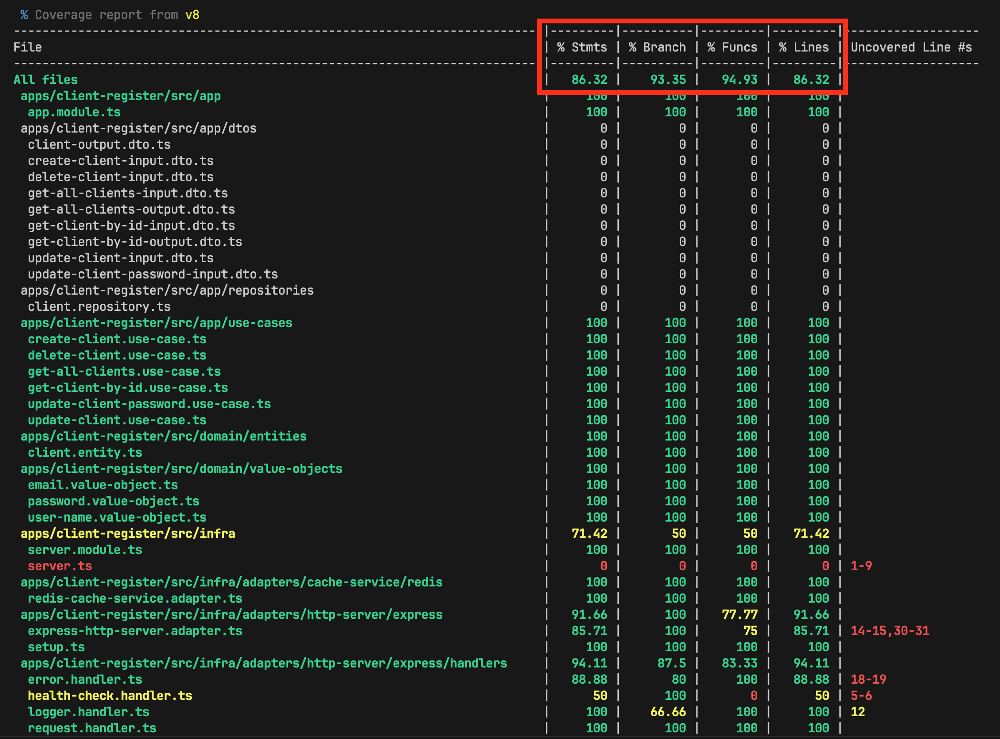

# Client Register

## 📌 Sobre o projeto

Este é um projeto de demonstração para cadastro de clientes, desenvolvido com Node.js e integrado a diversas tecnologias modernas. Ele simula um ambiente de produção com banco de dados, cache e mensageria, além de incluir testes automatizados.

A aplicação utiliza o framework **Express** e implementa uma arquitetura em camadas baseada nos princípios da **Clean Architecture**.

## 🚀 Tecnologias utilizadas

- **Node.js** (v22+)
- **Express**
- **MongoDB** com **Mongoose**
- **Redis**
- **Kafka**
- **Vitest** (testes unitários e de integração)
- **Supertest** (testes de API)

## 🐳 Como rodar localmente (modo rápido com Docker)

Se você já possui o Docker instalado, basta executar:

```bash
docker compose up --build -d
```

Para acessar os logs das aplicações, você pode usar:

```bash
docker compose logs -f client-register notification
```

Após isso:

- A aplicação estará disponível em:  
  [http://localhost:3000](http://localhost:3000)

- A documentação da API (Swagger) estará em:  
  [http://localhost:3000/api-docs](http://localhost:3000/api-docs)

> Existe um script para "seed" inicial, que popula o banco de dados com alguns clientes de exemplo. Para executá-lo, use:

```bash
# Certifique-se de que o MongoDB e o Redis estão rodando
pnpm seed
```

## 🛠️ Como rodar localmente (modo manual / completo)

### Pré-requisitos

- Node.js (versão 22 ou superior)
- PNPM (versão 10 ou superior)
- Docker + Docker Compose

### Passos

1. Instale as dependências do projeto:

```bash
pnpm install
```

2. Suba os containers das dependências (MongoDB, Redis e Kafka):

```bash
pnpm compose:up
```

3. Inicie a aplicação:

```bash
pnpm dev
```

4. Acesse:

- Aplicação: [http://localhost:3000](http://localhost:3000)
- Swagger (API Docs): [http://localhost:3000/api-docs](http://localhost:3000/api-docs)

## ✅ Executando os testes

Para rodar os testes:

```bash
pnpm test

# ou para modo watch:
pnpm test:watch

# ou usando a interface interativa:
pnpm test:ui
```



## 🏗️ Arquitetura do projeto

O projeto segue os princípios da **Clean Architecture**, separando bem as responsabilidades entre as camadas. Estrutura principal:

- **Domain (`src/domain/`)**  
  Contém as **entidades** e **regras de negócio** puras, sem dependências externas.

- **Application (`src/app/`)**  
  Contém os **casos de uso** e a **orquestração da lógica de aplicação**.

- **Infrastructure (`src/infra/`)**  
  Responsável pelas integrações externas, como:
  - Banco de dados
  - Cache
  - Mensageria
  - Servidor HTTP (Express)
  - Controllers e Repositórios concretos

## 📚 API Endpoints

Abaixo estão os endpoints disponíveis na API de cadastro de clientes:

### 📝 Criar um novo cliente

**POST** `/clients`

- **Input (JSON):**

```json
{
  "name": "John Doe",
  "email": "john.doe@example.com",
  "phone": "+5511999999999",
  "age": 30,
  "password": "senhaForte123@",
  "isActive": true
}
```

- **Possíveis respostas:**
  - 201: Cliente criado com sucesso
  - 400: Requisição inválida
  - 409: E-mail ou telefone já cadastrado

### 📄 Listar clientes (com paginação)

**GET** `/clients`

- **Parâmetros de query:**

  - `page` (obrigatório, ex: 1)
  - `limit` (obrigatório, ex: 10)
  - `search` (opcional, string de busca)
  - `sortBy` (opcional: name, email, phone, age, createdAt)
  - `sortOrder` (opcional: asc, desc)

- **Resposta 200 (exemplo):**

```json
{
  "data": [
    {
      "id": "123",
      "name": "John Doe",
      "email": "john.doe@example.com",
      "phone": "+5511999999999",
      "age": 30,
      "isActive": true,
      "createdAt": "2025-06-19T12:00:00Z",
      "updatedAt": "2025-06-19T12:00:00Z"
    }
  ],
  "total": 1,
  "page": 1,
  "limit": 10,
  "totalPages": 1
}
```

> Observação: A resposta não inclui o campo `password` por questões de segurança.

### 🔎 Buscar cliente por ID

**GET** `/clients/{id}`

- **Resposta 200:**

  - Dados completos do cliente.

- **Possíveis erros:** 400, 404

> Observação: A resposta não inclui o campo `password` por questões de segurança.

### ✏️ Atualizar cliente

**PATCH** `/clients/{id}`

- **Input (JSON):**

```json
{
  "id": "{id}",
  "name": "Novo Nome",
  "email": "novo.email@example.com",
  "phone": "+5511988888888",
  "age": 31,
  "isActive": true
}
```

> Observação: O único campo obrigatório é `id`. Os demais são opcionais e podem ser omitidos se não forem alterados.

- **Respostas:**
  - 204: Atualizado com sucesso
  - 400: Requisição inválida
  - 404: Cliente não encontrado
  - 409: Conflito (e-mail ou telefone já cadastrado)

### 🗝️ Atualizar senha do cliente

**PATCH** `/clients/{id}/password`

- **Input (JSON):**

```json
{
  "id": "{id}",
  "currentPassword": "senhaAntiga123",
  "newPassword": "novaSenhaForte456"
}
```

- **Respostas:**
  - 204: Senha atualizada
  - 400: Requisição inválida
  - 404: Cliente não encontrado
  - 409: Senha atual incorreta

### ❌ Deletar cliente

**DELETE** `/clients/{id}`

- **Respostas:**
  - 204: Cliente deletado
  - 400: Requisição inválida
  - 404: Cliente não encontrado

## ✅ Validações de campos

A aplicação possui validações específicas para os seguintes campos:

### 🧑‍💼 Nome (name)

- Deve conter apenas letras, espaços, hifens e apóstrofos.
- Exemplo de nomes válidos:
  - `"John Doe"`
  - `"Ana Maria"`
  - `"O'Connor"`
  - `"Jean-Paul"`

### 📧 Email

- Deve estar em um formato válido de e-mail.
- Exemplo válido:
  - `"user@example.com"`

### 🔑 Senha (password)

- Deve ter no mínimo 8 caracteres.
- Precisa conter pelo menos:
  - 1 letra maiúscula
  - 1 letra minúscula
  - 1 número
  - 1 caractere especial (ex: `@`, `#`, `$`, etc)

Exemplo de senha válida:

- `"StrongPass1@"`
